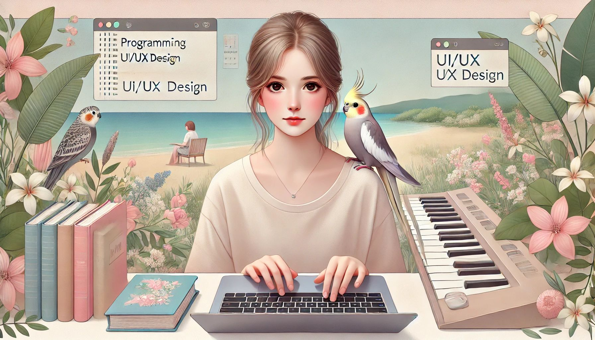

# Welcome to My Creative Space ✨
 

## 🌿 Who Am I?
I’m a learning front-end developer and UI/UX designer with a passion for growth and learning. My main focus is programming, particularly creating functional, user-friendly applications and websites. Every project I work on is a step forward in my journey—where design and code come together to create exceptional experiences.

## 🌱 My Skills:
- **Front-End Development**: Designing fast, responsive, and functional websites using HTML, CSS, JavaScript, and various frameworks.
- **UI/UX Design**: Creating simple, attractive, and user-friendly interfaces that are both beautiful and functional.

For me, programming isn't just a skill—it's a journey that I fall more in love with every day. Every project, every line of code, and every new challenge brings me closer to becoming the best version of myself.

## 💡 My Projects
Here, you’ll find my projects, a reflection of my dedication and passion for learning and creating. Whether I'm coding a simple website or a complex app, each project represents a step in my tech journey. I invite you to check out my repositories and enjoy the work I've done!

Check out some of my featured repositories:
- **[MyPaperTrails](https://github.com/LiliGhaznavi/MyPaperTrails)**: A personal notebook website for sharing thoughts.
- **[SkySavantApp](https://github.com/LiliGhaznavi/SkySavantApp)**: A weather app for tracking forecasts.
- **[SoulStretchStudio](https://github.com/LiliGhaznavi/SoulStretchStudio)**: A responsive yoga website design.

## 🛠️ The Tools I Love
I believe in the power of the right tools to bring ideas to life. These are my trusted companions in every project:

- **Figma**: For crafting intuitive, user-centered designs.
- **VS Code**: My playground for writing clean and efficient code.
- **Git & GitHub**: For version control and collaboration with a community of developers.
- **Tailwind CSS & Bootstrap**: Frameworks I use when needed, but my primary focus is on crafting responsive websites with the best fit for the project.

## 🎹 Life Beyond Code
When I'm not coding, I enjoy playing music. I play the piano and dive into philosophical books. I also spend time with my cockatiel, which adds joy to my life. Nature and the tranquility of the sea inspire me as well. These moments of calm and inspiration nourish my creativity and energy, allowing me to approach coding and design with fresh perspectives.

## 🌟 Let’s Build Together
This space is just the beginning—a place where we can grow, learn, and create new boundaries together. I'm always open to collaborating, receiving feedback, and learning from others. If you’re interested in tech, design, or coding, I’d love to connect with you!

"Feel free to connect with me on [LinkedIn](www.linkedin.com/in/lilighaznavi) for collaboration, feedback, or just to chat about tech and design!"

**"The only way to do great work is to love what you do."❤️✨**  
– Steve Jobs

